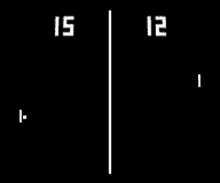

# FPGA-pong-game
Voor het vak FPGA heb ik een Pong-game ontwikkeld. Dit 15ec vak wordt in de laatste periode van het derde jaar gegeven door NHL Stenden Emmen en is tevens het laatste schoolvak voordat de minors en afstudeerperiode beginnen in jaar 4 beginnen. Het project is beoordeeld met een 7. 

## Opdrachtomschrijving
Voor het project heb ik besloten om een pong-game te ontwikkelen op de Altera DE2-115 board in de taal Verilog. De bedoeling is dat de Pong-game-interface wordt weergegeven op een VGA-monitor. Als invoer wordt een camera gebruikt om met de paddles de bal terug te kaatsen, waarbij handherkenning en bewegingsdetectie worden ingezet om de paddles te besturen.

Voor mijn eerste poging was het plan om doormiddel van contourdetection, edgedetection en een convex hull algoritme de handmotion detection te ontwikkelen, maar dat is helaas niet gelukt. Probleem is dat de camera kwaliteit niet optimaal is. Voor de convex hull algoritme neemt de camera teveel ruis waar en om dat per frame te verwerken is de Altera DE2-115 niet krachtig genoeg voor.

Daarna geprobeerd door middel van de technieken skinsegmentation, thresholding en framedifferencing de hand- en bewegingsdetectie te programmeren en dat is wel gelukt. 

## Hardware benodigdheden:
- Altera DE2-115 board
- D8M-GPIO camera
- VGA-monitor

## Software:
- Quartus Prime 21.1 - Lite Version
  
## Repository uitleg:
- pong_game_FPGA_1: Contour-, edgedetection
- pong_game_FPGA_2: handmotiondetection en pong interface
